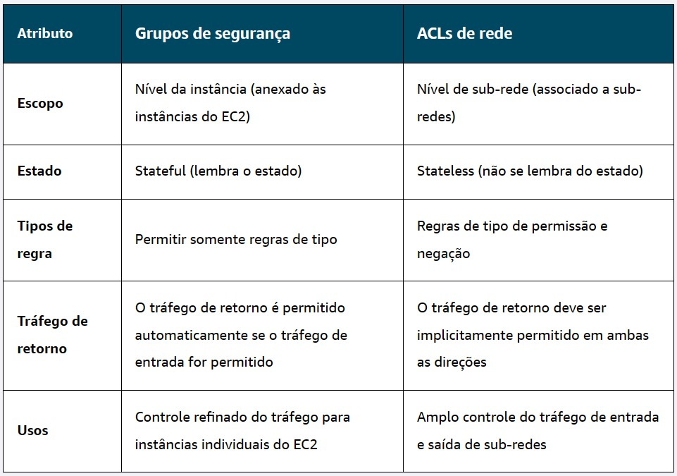

#  🔷 O que é AWS

## Modelo cliente-servidor

 É uma arquitetura de rede distribuída que divide tarefas entre provedores de recursos (servidores) e solicitantes
 de recursos (clientes).  Neste modelo, o cliente inicia a comunicação enviando uma solicitação, e o servidor aguarda,
 processa o pedido e retorna a resposta, geralmente através de protocolos como HTTP, FTP ou SMTP.

## Princípio on demand

Operações On-Demand funcionam com base nas necessidades, ou encomendas, dos clientes, ou seja, é um produto ou serviço
sob demanda. Isso quer dizer que essa estratégia busca atender aos clientes da forma mais conveniente possível,
de acordo com as solicitações realizadas.

## O que é computação em nuvem

É o fornecimento de serviços de computação, incluindo servidores, armazenamento, bancos de dados, sistema de rede,
software, análise e inteligência, pela Internet (“a nuvem”) para oferecer inovações mais rápidas, recursos flexíveis e
economias de escala. Você normalmente paga apenas pelos serviços de nuvem que usa, ajudando a reduzir os custos
operacionais, a executar sua infraestrutura com mais eficiência e a dimensionar conforme as necessidades da sua
empresa mudam.

## Tipos de implantação na nuvem:

- cloud: Flexibilidade de migrar os recursos existentes para a nuvem, projetar e criar novas aplicações no ambiente de
nuvem ou usar uma combinação de ambos.

- on-premises: Usa ferramentas de virtualização e gerenciamento de recursos não oferece muitos dos benefícios da
computação em nuvem. No entanto, às vezes é procurada por sua capacidade de fornecer recursos dedicados e baixa latência.

- hybrid: Os recursos baseados em nuvem e a infraestrutura on-premises funcionam juntos. Ideal para situações em que as
aplicações legadas devem permanecer on-premises devido às preferências de manutenção ou aos requisitos regulatórios.

## Benefícios da nuvem:
- capacidade de pagar conforme o uso (trocas de despesas fixas por despesas variáveis)
-economia de escala massiva.
- parar de advinhar a capacidade
- aumento de velocidade e agilidade
- parar de gastar dinheiro mantendo data-centers
- globalização em minutos

## Infraestrutura global AWS
- Alta disponibilidade
- Tolerância a falhas
- zonas de disponibilidade (AZ's)

 ## Modelo de responsalididade compartilhada

### Responsabilidade do cliente (segurança NA nuvem)

- Dados do cliente
- Criptografia de dados do cliente

### Responsabilidade do cliente OU da aws(depende do serviço)

- criptografia de dados do servidor
- proteção de dados em trânsito
- plataforma, aplicações, gerenciamente de identidades e acessos
- configuração do sistema operacional, rede e firewall

### Responsabilidade da aws(segurança DA nuvem)

- atualização de softwares de conputação, armazenamento, banco de dados e redes
- infraestrutura global da AWS e hardware(regiões AZs e locais de borda)

## Amazon Elastic Compute Cloud (EC2)

- Altamente flexível
- Econômico
- Rápido

### Multilocação

Compartilhamento dos recursos fornecidos pelo host

- Escalar verticalmente : aumentar ou diminuir o tamanho das instâncias conforme necessidade.
- Escalar horizontalmente:

## Famílias do Amazon(EC2)

- Uso geral: 
  - Equilíbrio de recursos
  - cargas de trabalho diversas
  - serviços web
  - repositórios de código

- Otimizadas para computação:
  - Tarefas com uso intensivo de computação
  - servidores de jogos
  - computação de alto desempenho (HPC)
  - tarefas de aprendizado de máquina
  - modelagem científica
  
- Otimizadas para memória:
  - tarefas com uso intensivo de memória

- Computação acelerada
  - cálculos de ponto flutuante
  - processamento grafico
  - correspondência de padrões de dados
  - aceleradores de hardware
  
- Otimizadas para armazenamento
  - alto desempenho pra dados armazenados localmente

## Interagindo com serviços da AWS

- Console de gerenciamento da AWS
  - configura ambientes de testes
  - visualizar faturas da aws
  - monitorar recursos
  - gerenciar tarefas não técnicas
  
- Interface de linha de comando da AWS(CLI)
  - automatizar tarefas por meio de scripts
  
- Kit de desenvolvimento de software (SDK)
  -integração dos serviços da aws em suas aplicações fornecendo APIs para várias linguagens de programação

## O que é AMI

Imagens de máquina da amazon (AMI - amazon machine image) pode ser definida como um modelo pré-configurado de máquina virtualque já inclui todos os elementos essenciais para a criação de uma nova instância

## componentes

sistema operacional
estrutura de armazenamento
definição de arquitetura
permissões para o lançamento da instância
aplicações de software previamente instaladas

* obs.: a partir de uma ṕunica AMI é possṕivel implantar múltiplas instâncias EC2

## 3 maneiras de usar AMI

criar a sua própria AMI
usar AMIs da AWS disponíveis
comprar no AWS marketplace

## Repetibilidade da AMI
mesma configuração -> implantações automatizadas -> ambientes consistentes -> scaling com confiança

## Opções de cobrança do EC2
- sob demanda - paga conforme capacidade computacional que sua aplicação consome
- saving plans - preços mais baixos (72% desconto) em troca de um compromisso de 1 a 3 anos (é possível alterar o tamanho da EC2)
- instâncias reservadas - (75% desconto) para cargas de trabalho instável e previsível (não altera tamanho de EC2) 1 ou 3 anos
- instâncias spots - (90% desconto) AWS pode recuperar instâncias a qualquer momento e cliente recebe aviso de 2 minutos para salvar o progresso
- hosts dedicados - servidor físico real para reserver para uso exclusivo
- instâncias dedicadas - instância dedicada exclusiva isolando operações de outros clientes da aws

## Escalabilidade vs Elasticidade

escalabilidade é a capacidade do sistema ser expandido ao longo do tempo. habilidade para suportar uma carga de trabalho crescente por meio de adição de mais recursos.
 - escala vertical: aumenta o poder de processamento das máquinas atuais
 - escala horizontal: adição (scale out) ou remoção (scale in) de novas máquinas à infraestrutura
elasticidade trata do ajuste dinâmico de recursos para atender demandas momentâneas. permite o sistema aumentar ou diminuir recursos de forma automatizada em resposta às variações de demanda em tempo real

## Amazon EC2 Auto Scaling

Ajusta automaticamente o número de instâncias com base nas mudanças na demanda da aplicação.
 - escalonamento dinâmico - se ajusta em tempo real às flutuações de demanda.
 - escalonamento preditivo - agenda preditivamente o número certo de instâncias previstas

### Groupo deauto scaling

precisa ter três configurações principais:
 - capacidade mínima - menor número de instâncias necessárias para manter a aplicação executando
 - capacidade desejada
 - capacidade máxima

## Elastic Loud Balancing (ELB)

Serve para distribuir de forma automática o fluxo de tráfego de uma aplicação entre diversos recursos com o objetivo de otimizar o desempenho e a confiabilidade
atua como ponto centralizado de entrada para todo o trafégo web.
principais benefícios:
 - distribuição eficiente de tráfego
 - auto scaling
 - gerenciamento simplificado

métodos de roteamento:
 - round robin
 - menor número de conexões
 - hash de ip
 - menor tempo de resposta

## Amazon EventBridge
serviço com tecnologia sem servidor (serverless) que conecta diferentes partes da aplicação usando eventos
serve para quando existem etapas intermediárias entre o começo e o fim, que serão acionadas (eventos)

## Amazon Simple Queue Service (SQS)
enfileiramento de mensagens projetado para estabelecer uma comunicação de alta confiabilidade entre diferentes componentes de software
permite o envio, armazenamento e recebimento de mensagens com garantia de que nenhuma mensagem será perdida

## Amazon Simple Notification Service (SNS)
opera com base no modelo de publicação/assinatura. publicadores enviam mensagens para múltiplos assinantes por meio de canais centralizados

## Tipos de gerenciamento
### Gerenciado
você tem um serviço pré-configurado para dar mais conveniencia
### Não-gerenciado
você tem total responsabilidade para personalizar o serviço
### Serverless
(sem servidor) você não pode ver ou acessar a infraestrutura subjacente

## AWS Lambda
um serviço que executa código em resposta a eventos sem necessidade de provisionar ou gerenciar servidores

## Amazon Elastic Container Service (ECS)
- simplificado e integrado
- possibilidade de definir parâmetros
- serviço totalmente gerenciado

## Amazon Elastic Kubernetes Service (EKS)
- plataforma de código aberto
- mais complexa
- mais controle e flexibilidade

## Amazon Elastic Container Registry (ECR)
- registro de conteineres totalmente gerenciado
- armazena imagens de conteiner

## Amazon Fargate
alternativa de computação serverless para usar quando não quer configurar os serviços EC2

### Como as peças se encaixam
- carrega as imagens de conteineres no ECR
- escolha um serviço de orquestração com base no que precisa (ECS ou EKS)
- escolha a opção de computação (EC2 ou Fargate)

## AWS Elastic Beanstalk
- provisionamento simplificado
- gerenciamento de configurações
- visibilidade e controle

## AWS Batch
- gerenciamento de infraestrutura
- suporte à processamento paralelo
- escalabilidade automática

## Amazon Lightsail
- simplicidade
- bom custo benefício
- infraestrutura gerenciada

## AWS Outposts
- solução de nuvem híbrida
- ambientes consistentes
- baixa latência e residência de dados

## escolha de regiões AWS: considerações
- conformidade - devem permanecer dentro dos requisitos de uma área
- proximidade - deve escolher uma proximidade mais próxima dos clientes
- disponibilidade de recursos - escolher uma região que tenha todos os recursos necessários
- preço - alguns locais são mais econômicos para operar

## Amazon CloudFront
rede de entrega contínua, tem o objetivo de servir o conteúdo mais próximo possível dos usuários. trabalha com locais de borda
### Locais de borda
serve como uma memória cache para diminuir a latência na entrega do conteúdo

## CloudFormation
serviço que ajuda a modelar e configurar os recursos da AWS para que vc gaste menos tempo gerenciando esses recursos e tenha mais tempo para se concentrar nas aplicações executadas na AWS

## Amazon Virtual Private Cloud (VPC)
permite provisionar uma seção logicamente isolada da aws em que vc pode executar recursos da aws em uma rede virtual definida por vc

### benefícios VPC
- aumentar segurança
- economizar tempo
- controle de acesso

### Sub-rede
sub-seção de uma vpn, pública ou privada. privada = usada para conter recursos como banco de dados que armazena informações sensíveis. pública = contém recursos como um site voltado pro cliente

### Gateway de internet
conexão entre VPC e internet.

### Gateways privados virtuais
permite que o tráfego protegido da internet ingresse na VPC. precisa de uma conexão de rede privada virtual (virtual private network - VPN).

### VPN (virutal private network)
criptografa o tráfego na internet para proteger de qualquer pessoa. possibilita estabelecer conexão VPN entre VPC e a rede privada

## AWS Client VPN
serviço de rede usado para conectar profissionais remotos e redes on-premises na nuvem. fornece autenticação avançada e acesso remoto, é elástica etotalmente gerenciada.

## AWS Site-to-Site VPN
cria conexão segura entre o data center ou as filiais e seus recursos da nuvem. oferece alta disponibilidade, sessões seguras e privadas e acelera aplicações.

## AWS PrivateLink
tecnologia altamente disponível e dimensionável que pode ser usada para conectar à VPC de forma privada a serviços e recursos como se estivessem na sua VPC. ajuda a proteger o tráfego e a se conectar com regras de gerenciamento simplificadas.

## AWS Direct Connect
permite estabelecer uma conexão privada dedicada entre sua rede e à VPC na nuvem. reduz custos de rede e aumenta a quantidade de largura de banda.
- aplicações sensíveis a latência
- migração ou transferência de dados em grande escala
- arquitetura de nuvem híbrida

## Serviços adicionais de gateway
- AWS Transit Gateway
- Gateway de conversão de endereços de rede (NAT)
- Amazon API Gateway

## ACLs de Rede
firewall virtual que controla o tráfego de entrada e saída no nível da sub-rede. cada conta aws tem uma ACL de rede padrão. ao configurar a VPC, vc pode usar a padrão ou criar ACLs de rede personalizadas.
- padrão - permite entrada e saída normalmente
- personalizada - bloqueia entrada e saída até que adicione as regras

obs.: são stateless, não lembram de nada e verifica os pacotes em todos os sentidos: entrada e saída

## Grupos de segurança
controla o tráfego de entrada e saída no nível do recurso. 
- padrão - nega todo tráfego de entrada e permite todos de saída
- personalizada - configura qual tráfego deve ser permitido, qualquer outro tráfego seria negado.

obs.: são statefull, as decisões lembram das decisões anteriores para pacotes recebidos

## Amazon Route 53
é um DNS que fornece uma maneira confiável e enonomica de rotear os usuários finais para aplicação de internet.
capacidade de gerenciar os registros DNS para nomes de domínio, vc pode registrar novos nomes de domínio diretamente no route 53.

## Amazon CloudFront
é um serviço de rede de entrega de conteúdo (CDN) que entrega o conteúdo com tempos de carregamentos mais rápidos, economia de custos e confiabilidade.

## AWS Global Accelerator
é um serviço que usa rede global da aws para melhorar a disponibilidade, o desempenho e a segurança das aplicações. ela usa roteamento inteligente de tráfego e failover rápido se algo der errado em um dos locais de sua aplicação.

## Armazenamento

### Armazenamento em bloco
- divide os dados em partes gerenciáveis chamados blocos
- podem ser atualizados bloco por bloco, o arquivo inteiro não precisa ser alterado
- ideal para aplicações ou banco de dados com atualizações rápidas e frequentes
tipos:
- armazenamento de instâncias do ec2
  - sem persistência de dados
  - benefícios: armazenamento disponível automaticamente, econômico, alto desempenho
- Amazon Elastic Block Store (EBS)
  - com persistência de dados
  - beníficios: migração de dados, alterações no tipo de instância, recuperação de desastres, otimização de custos, ajuste de desempenho

### Armazenamento de objetos
tipos: Amazon Simple Storage Service (S3)
- objetos + dados + ID único + metadados
- requer reescrita do objeto inteiro para cada alteração
- organizados em estruturas planas chamadas buckets
- ideal para grandes arquivos que não mudam constantemente

### Armazenamento de arquivos
tipos: Amazon Elastic File System (EFS), Amazon FSx
- usa sistema de arquivos hierárquico que pode ser compartilhado por aplicações
- implantação direta sem modificação de código
- ideal para aplicações que requerem acesso compartilhado

### Serviços de armazenamento adicionais
não se encaixam nas opções acima, mas são importantes
tipos: AWS Storage Gateway, AWS Elastic Disaster Recovery

## Amazon Data Lifecycle Manager
- programar criação de snapshots
- definir políticas de retenção
- gerenciar ciclos de vida
- aplicar políticas de backup consistentes
fluxo de trabalho:
1. criar política de snapshots
2. selecione o tipo de recurso de destino
3. excluir volumes
4. defina horários personalizados
5. aplique ações adicionais

### Snapshots do EBS
- snapshots = são backups pontuais do volume do EBS, usado para recuperação de desastres, migração de dados
- benefícios: proteção e recuperação de dados, flexibilidade operacional, econômico

## Amazon Simple Storage Service (S3)
- armazene dados como objetos
- armazene objetos em buckets
- upload de objetos com até 5tb
- crie múltiplos buckets
- versionamento de objetos

benefícios:
- armazenamento praticamente ilimitado
- gerenciamento do ciclo de vida de objetos
- ampla variedade de casos de uso

segurança no S3:
- acesso privado por padrão
- políticas de acesso aos buckets
- urls pré-assinadas
- pontos de acesso do S3
- logs de auditoria do S3

## Classes de Armazenamento e casos de uso do S3

### S3 Standard
armazenamento de uso geral para aplicações em nuvem, é usado por padrão

### S3 Intelligent-Tiering
é útil se os dados tiverem padrões de acessos desconhecidos, move automaticamente o dado para o padrão mais economico com base na frequencia de acesso. armazena em 3 camadas:
- acesso frequente
- pouco frequente
- acesso instantâneo

### S3 Standard Infrequent-Access (Standard-IA)
é usado para dados acessados com menos frequência, mas que exigem acesso rápido quando necessário

### S3 One Zone Infrequent-Access (One Zone-IA)
armazena dados em uma única zona de disponibilidade, reduzindo custos em comparação como Standard-IA

### S3 Express One Zone
armazena em umna única zona de disponibilidade e foi criado especificamente para fronecer acesso consistente a dados mais frequentes

### S3 Glacier Instant Retrieval
arquivar dados raramente acessados e que requer recuperação em milissegundos

### S3 Glacier Flexible Retrieval
oferece armazenamento de baixo custo para dados acessados de 1 a 2 vezes por ano, com recuperação rápida

### S3 Glacier Deep Archive
tem o menor custo e oferece suporte a à retenção a longo prazo, podendo manter o dado por sete a dez anos ou mais. tem tempo de recuperação de até 12 horas.

### S3 Outposts
fornece armazenamento de objetos para o ambiente on-premises AWS Outposts, desempenho ideal quando os dados precisam permanecer próximos às aplicações on-premises

## S3 LifeCycle
- ações de transição - definem quando os objetos fazem a transição para outra classe de armazenamento
- ações de expiração - definem quando os objetos expiram e são excluídos

## Amazon Elastic File System (EFS)
serviço de armazenamento totalmente gerenciado e dimensionável para uso com AWS Cloud Services e recursos on-premises. escala automaticamente para petabytes à medida que adiciona ou remove arquivos sem interromper aplicações.

Benefícios do EFS:
- redundância multi-AZ
- acesso compartilhado
- armazenamento elástico

classes de armazenamento EFS:
- armazenamento padrão
- armazenamento de uma zona
- armazenamento de arquivos

ciclo de vida EFS:
- transiação para IA (infrequent-access)
- transição para arquivo
- transição para padrão

## Amazon FSx
oferece suporte a vários protocolos de sistemas de arquivos, incluindo windows file server, lustre, OpenZFS e NetApp ONTAP

benefícios do FSx:
- integração do sistema de arquivos
- infraestrutura gerenciada
- armazenamento dimensionável
- econômico

## AWS Storage Gateway
possibilita integração perfeita de ambientes on-premises com armazenamento em nuvem

benefícios:
- integração perfeita
- gerenciamento de dados aprimorado
- cache local
- otimização de custos

tipos de gateway:
- Amazon S3 File Gateway
- Gateway de volumes
- Gateway de fitas

## Elastic Disaster Recovery
replica workloads críticas para aws com o mínimo de tempo de inatividade. recuperação rápida.

benefícios:
- resiliência empresarial
- recuperação de desastres simplificada
- otimização de custos

## Amazon RDS (RELATIONAL DATABASE SERVICE)

- Aplicação automatizada de patches
- backups
- redundância
- failover
- recuperação de desastres

### Beneficios:

- otimização de custos
- implantação multi-az
- otimização de desempenho
- controles de segurança

## Amazon Aurora
- Postgresql
- mysql
- dsql
- até 15 replicas nas az's
- supporte ao AWS backup

### Benefícios

- alto desempenho e disponibilidade
- armazenamento automatizado e gerenciamento de backup
- replicação avançada e tolerância a falhas

## Amazon DynamoDB
- banco de dados relacional
- dados = itens = coleção de atributos
- atributo = nome + valor
- adicione ou remova atributos a qualquer momento

### benefícios
- escalabilidade com capacidade provisionada
- alto desempenho consistente
- alta disponibilidade e durabilidade
- criptografia de dados

## Amazon Elasticache
- simplifica a implantação, operação e escalabilidade do armazenamento de dados na memória
- automatiza o gerenciamento de tarefas-chave
- melhora a performance e eficiência
- oferece escalabilidade flexível
- reduz as operações em geral

### benefícios
- alto desempenho para instâncias Redis, Valkey ou Memcached
- alta disponibilidade
- replicação em várias AZs
- criptografia de dados

## outros serviços de banco de dados
- Amazon DocumentDB
- AWS Backup
- Amazon Neptune

## serviços de IA/ML
nível 1
### serviços de linguagem
- Amazon Comprehend
- Amazon Polly
- Amazon Transcribe
- Amazon Translate

### serviços de pesquisa e visão computacional
- Amazon Kendra
- Amazon Rekognition
- Amazon Textract

### IA conversacional e serviços de personalização
- Amazon Lex
- Amazon Personalize

nível 2
### serviços de ML
- Amazon SageMaker IA

nível 3
### frameworks e infraestrutura de ML
